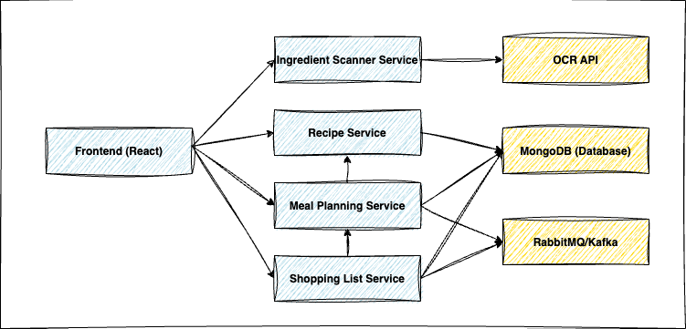

# Smart Recipe & Meal Planner

A microservices-based application that suggests meal plans based on available ingredients, dietary preferences, and user history.

## Microservices Architecture

The system consists of four key microservices:

| Microservice | Responsibilities |
|--------------|------------------|
| Ingredient Scanner Service | Uses OCR to detect ingredients from uploaded images (e.g., grocery lists, fridge contents) |
| Recipe Service | Stores & retrieves recipes, categories, and nutritional information |
| Meal Planning Service | Suggests meal plans based on available ingredients, dietary preferences, and user history |
| Shopping List Service | Creates a grocery list for missing ingredients based on meal selection |

### Architecture Diagram



### Data Flow & Communication

The system follows a hybrid communication model, combining REST APIs for synchronous interactions and RabbitMQ/Kafka for asynchronous messaging.

#### API Flow (REST Communication)

- Frontend → Recipe Service: Fetch available recipes (GET /recipes)
- Frontend → Ingredient Scanner Service: Upload an image for OCR processing (POST /scan)
- Frontend → Meal Planning Service: Request meal plan suggestions (POST /plan)
- Frontend → Shopping List Service: Retrieve shopping lists (GET /shopping-list)

#### Event Flow (Message Queue - Optional)

- Ingredient Scanner Service publishes IngredientExtracted event → Recipe Service updates ingredient data
- Meal Planning Service publishes MealPlanCreated event → Shopping List Service generates a list
- Shopping List Service publishes ShoppingListUpdated event → Frontend gets real-time updates

## Tech Stack

- **Frontend**: React + TypeScript + Tailwind CSS + Vite
- **Backend**: FastAPI (Python)
- **Database**: MongoDB
- **OCR**: Tesseract OCR or Google Vision API
- **Messaging** (optional): RabbitMQ/Kafka for event-driven architecture

## Database Schema (MongoDB)

Each microservice has its own MongoDB collection:

- **recipes**: Stores recipes and ingredients
- **scanned_ingredients**: Stores extracted OCR data
- **meal_plans**: Stores generated meal plans
- **shopping_lists**: Stores shopping list details

Example schema for a Recipe document:
```json
{
  "_id": "ObjectId(123456)",
  "name": "Spaghetti Bolognese",
  "ingredients": ["Tomatoes", "Minced Meat", "Garlic", "Pasta"],
  "instructions": "Cook pasta and mix with sauce.",
  "created_at": "2025-03-10T12:00:00Z"
}
```

## Setup Instructions

### Prerequisites

- Node.js (v16+)
- Python (v3.9+)
- Docker and Docker Compose

### Installation

1. Clone the repository
```bash
git clone https://github.com/yourusername/smart-recipe-meal-planner.git
cd smart-recipe-meal-planner
```

2. Start the services using Docker Compose
```bash
docker-compose up
```

3. Access the application
- Frontend: http://localhost:3000
- API Documentation: http://localhost:8000/docs

## Development

### Frontend

```bash
cd frontend
npm install
npm run dev
```

### Backend Services

Each service can be run independently for development:

```bash
cd backend/recipe-service
pip install -r requirements.txt
uvicorn main:app --reload --port 8001
```

## Project Structure

```
smart-recipe-meal-planner/
├── frontend/                 # React frontend application
│   ├── src/                  # React components and code
│   ├── docs/                 # Architecture documentation
│   └── public/               # Static assets
├── backend/                  # Backend services
│   ├── recipe-service/       # Recipe database service
│   ├── ingredient-scanner-service/ # OCR ingredient detection
│   ├── meal-planning-service/     # Meal planning engine
│   └── shopping-list-service/     # Shopping list generator
└── docker-compose.yml        # Docker compose configuration
```

## API Endpoints

- `/api/recipes` - Recipe management
- `/api/ingredients/scan` - Ingredient scanning
- `/api/meal-plans` - Meal planning
- `/api/shopping-list` - Shopping list generation

## Security Considerations

- Authentication: OAuth/JWT-based authentication for API access
- Rate Limiting: Prevent excessive API requests with rate limiting middleware
- CORS Handling: Ensure proper Cross-Origin Resource Sharing (CORS) configuration

## Future Enhancements

- Implement GraphQL API for flexible data fetching
- Add monitoring service (e.g., Prometheus + Grafana) for performance tracking
- Enhance AI-based ingredient suggestions for meal planning

## License

MIT 